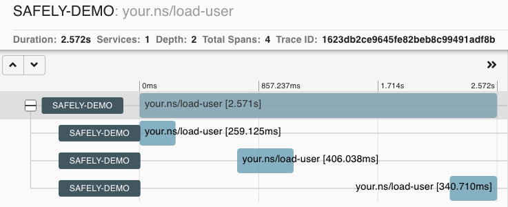
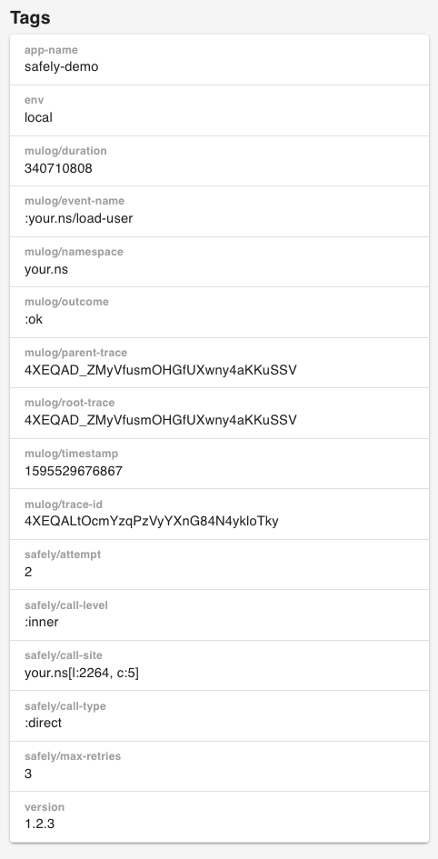

# Observability with safely

`safely` has a comprehensive tracking system.

> Prior version `0.7.0`, `safely` relied on a library called
> [TRACKit!](https://github.com/samsara/trackit) which in turns it is a
> wrapper for the popular [Dropwizard's
> Metrics](https://github.com/dropwizard/metrics) library.  So if you
> are using an older version please refer to the online documentation:
> [`safely-0.5.0` tracking](https://cljdoc.org/d/com.brunobonacci/safely/0.5.0/doc/safely-tracking-)


From version `0.7.0`, `safely` internally uses a library called
[***μ/trace***](https://github.com/BrunoBonacci/mulog) for event-based
logging and tracing.

Out of the box by just adding the `:track-as` option in a safely block
you get tracing instrumentation of the safely block.  The
instrumentation is done at two levels: *the inner block the outer
block*.

The inner block is the code expression which will be executed
potentially multiple times. The outer block is executed only
once per evaluation.


For example let's take a look at the following code snippet:

``` clojure
(ns your.ns)

(safely                                          \
                                                 |
  ;; an external call                 \          |
  (users/load-user :id "d548a66b")    | Inner    |
                                      /          | Outer
  :on-error                                      |
  :max-retries 3                                 |
  :default     nil                               |
  :track-as    ::load-user)                      /
```

The `users/load-user` call is in a safely block, and we have added the
`:track-as :your.ns/load-user` option. In this case `safely` will
automatically instrument and push events with the following structure:

  * 1 event for every attempt (inner execution)
  * 1 event for the overall `safely` block execution (outer)

So if we assume that in one instance of this execution the inner call
failed twice before succeeding the we will have in total **4 events**:

  * two failed attempts (`:safely/attempt 0` and `:safely/attempt 1`)
    with `:mulog/outcome :error` and the exception generated in the
    `:exception` value.
  * one successful attempt (`:safely/attempt 2`) with `:mulog/outcome :ok`
  * one event with describes the outer call (`:safely/call-level :outer`)
    with the overall `:mulog/outcome :ok`
  * all the events will have the starting `:mulog/timestamp` and the duration
  (`:mulog/duration`) expressed in **nanoseconds**.
  * All the events have a bunch of IDs to identify the records and
    their logical relationship.
  * If an error occurred, the `:exception` key will contain the actual exception.
  * If the application user defined a *global-context* or
    *local-context*, the events will inherit all of those (see:
    [μ/log - use of context](https://github.com/BrunoBonacci/mulog#use-of-context)).
    In our example we assume `:app-name`, `:version` and `:env` where
    set via global context.

Here the events with all the details.

<details>
  <summary><strong>Click to show details</strong></summary>

``` clojure
{:mulog/event-name :your.ns/load-user,
 :mulog/timestamp 1595529674636,
 :mulog/trace-id #mulog/flake "4XEQAD_Z_W2zwXpyCPOMnVtsDBXvzzt5",
 :mulog/root-trace #mulog/flake "4XEQAD_ZMyVfusmOHGfUXwny4aKKuSSV",
 :mulog/parent-trace #mulog/flake "4XEQAD_ZMyVfusmOHGfUXwny4aKKuSSV",
 :mulog/duration 259125129,
 :mulog/namespace "your.ns",
 :mulog/outcome :error,
 :app-name "safely-demo",
 :env "local",
 :exception #error {
   :cause "Connection timeout!"
   :data {:cause :timeout}
   :via
   [{:type clojure.lang.ExceptionInfo
     :message "Connection timeout!"
     :data {:cause :timeout}
     :at [clojure.core$ex_info invokeStatic "core.clj" 4617]}]
   :trace
   [[..full stack trace..]
    [...] ;; stack omitted for brevity
    [clojure.lang.AFn run "AFn.java" 22]
    [java.lang.Thread run "Thread.java" 832]]},
 :version "1.2.3",
 :safely/attempt 0,
 :safely/call-level :inner,
 :safely/call-site "your.ns[l:2264, c:5]",
 :safely/call-type :direct,
 :safely/max-retries 3}

{:mulog/event-name :your.ns/load-user,
 :mulog/timestamp 1595529675338,
 :mulog/trace-id #mulog/flake "4XEQAGBpt66OLi5Ut97GRRJvLzjdgBrI",
 :mulog/root-trace #mulog/flake "4XEQAD_ZMyVfusmOHGfUXwny4aKKuSSV",
 :mulog/parent-trace #mulog/flake "4XEQAD_ZMyVfusmOHGfUXwny4aKKuSSV",
 :mulog/duration 406038359,
 :mulog/namespace "your.ns",
 :mulog/outcome :error,
 :app-name "safely-demo",
 :env "local",
 :exception #error {
   :cause "Connection timeout!"
   :data {:cause :timeout}
   :via
   [{:type clojure.lang.ExceptionInfo
     :message "Connection timeout!"
     :data {:cause :timeout}
     :at [clojure.core$ex_info invokeStatic "core.clj" 4617]}]
   :trace
   [[..full stack trace..]
    [...] ;; stack omitted for brevity
    [clojure.lang.AFn run "AFn.java" 22]
    [java.lang.Thread run "Thread.java" 832]]},
 :version "1.2.3",
 :safely/attempt 1,
 :safely/call-level :inner,
 :safely/call-site "your.ns[l:2264, c:5]",
 :safely/call-type :direct,
 :safely/max-retries 3}

{:mulog/event-name :your.ns/load-user,
 :mulog/timestamp 1595529676867,
 :mulog/trace-id #mulog/flake "4XEQALtOcmYzqPzVyYXnG84N4ykloTky",
 :mulog/root-trace #mulog/flake "4XEQAD_ZMyVfusmOHGfUXwny4aKKuSSV",
 :mulog/parent-trace #mulog/flake "4XEQAD_ZMyVfusmOHGfUXwny4aKKuSSV",
 :mulog/duration 340710808,
 :mulog/namespace "your.ns",
 :mulog/outcome :ok,
 :app-name "safely-demo",
 :env "local",
 :version "1.2.3",
 :safely/attempt 2,
 :safely/call-level :inner,
 :safely/call-site "your.ns[l:2264, c:5]",
 :safely/call-type :direct,
 :safely/max-retries 3}

{:mulog/event-name :your.ns/load-user,
 :mulog/timestamp 1595529674636,
 :mulog/trace-id #mulog/flake "4XEQAD_ZMyVfusmOHGfUXwny4aKKuSSV",
 :mulog/root-trace #mulog/flake "4XEQAD_ZMyVfusmOHGfUXwny4aKKuSSV",
 :mulog/duration 2571433163,
 :mulog/namespace "your.ns",
 :mulog/outcome :ok,
 :app-name "safely-demo",
 :env "local",
 :version "1.2.3",
 :safely/call-level :outer,
 :safely/call-site "your.ns[l:2264, c:5]",
 :safely/circuit-breaker nil}

```
</details>


***μ/log*** has the possibility to publish all these events to various
systems. It is recommended to use
[Elasticsearch](https://www.elastic.co/elasticsearch/) to search and
quickly aggregates quantitative measure across all the events, but
there are a number of supported systems where you can send the events
for further processing, aggregation, alerting, please refer to
[μ/log documentation](https://github.com/BrunoBonacci/mulog) for a
complete list of available publishers.

One of the systems that works well with `safely` is
[Zipkin](https://zipkin.io/) (or any OpenZipkin compatible system) for
distributed tracking.  All `safely` blocks are automatically
instrumented with ***μ/trace*** which provides events in a format
which is compatible to distributed tracing, hence, by activating the
Zipkin publisher as follow:

``` clojure
(μ/start-publisher!
  {:type :zipkin
   :url  "http://localhost:9411/"})
```

you can get the above events in the form of traces:




Each blueish block (span) corresponds to an attempt, the size of the
span correspond to the `:mulog/duration` and the top level span is the
**outer** call. All the additional information available in the events will be pushed as tags
and therefore can be queried by the Zipkin interface.

<details>
  <summary>Click to show</summary>



</details>


If you are using a *circuit-breaker* with `safely` the following
additional metrics are published.

For example let's take a look at the following code snippet:

``` clojure
(safely

  ;; an external call
  (users/load-user :id "d548a66b")

  :on-error
  :max-retries 3
  :default     nil
  :track-as    ::load-user
  :circuit-breaker :user-service)
```

In this case in addition to all the previous information,
each event will contain also the following keys:

``` clojure
;; which circuit-breaker is in use with the block
:safely/circuit-breaker :user-service

;; if a timeout is set via the `:timeout` option it will
;; appear in the `:inner` calls, `nil` otherwise.
:safely/timeout nil

;; if the circuit breaker is blocking a call or is successful
:safely/circuit-breaker-outcome :success
```

The key `:safely/circuit-breaker-outcome` will have one of the following values:

  * `:success` - inner block successfully executed
  * `:execution-error` - refers to an error in the execution of the inner block.
  * `:timeout` - the inner block execution didn't complete in time.
  * `:queue-full` - when the processing queue can't accept more items.
  * `:circuit-open` - when the circuit breaker is `open` and all
    requests are rejected for a certain amount of time.
