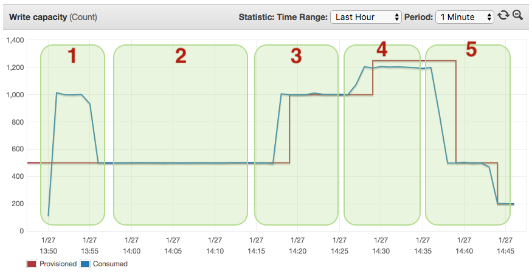

# Safely usage on ETL-loading jobs.

This is a sample program that load a large file with millions of
records into a dynamo table. This example shows the use of `safely` in
a ETL context where your DB might be temporarily unavailable or might
throttle your requests based on usage quota limits. `safely` is
especially good in this case as it allows you to retry the failing
operation with a simple declaration.  The exponential backoff will
ensure that you always fully utilise the resources available (write
throughput) without swamping the system, and it will efficiently adapt
to changing conditions like an increase or decrease of capacity.


## Scenario

  - We have a large file with one record per line in json format
    (`/tmp/large-file.json`).
  - The large file contains 1 million records and each record is
    approximately 1KB
  - We want to load this file into a DynamoDB table and use all
    available write capacity.
  - **The capacity may vary at runtime, we want to adapt**
  - **We want to be resilient and tolerant of transitional failures**
    due to network errors, server errors or quota management
    (throttling).

Here is how we can do this with `safely`

``` Clojure
(ns safely.examples.etl-load.core
  (:require
   ;; utilities to create/delete table
   [safely.examples.etl-load.util :as u]
   ;; AWS clojure client
   [amazonica.aws.dynamodbv2 :as dyn]
   ;; JSON parser
   [cheshire.core :as json]
   ;; Clojure parallel reduers
   [clojure.core.reducers :as r]
   ;; utility for working with large files
   [iota]
   ;; Safely retry errors.
   [safely.core :refer [safely]]))
```

Let's assume we have the following configuration:

``` Clojure
(def cfg
  {:table-name           "test-safely-etl-load"
   :read-capacity-units  10
   :write-capacity-units 500
   :region               "eu-west-1"})

```

Then we have a function which takes a file name as input and, in
parallel, tries to load each record into DynamoDB.

``` Clojure
(defn load-records-from-file
  [{:keys [table-name region] :as cfg} file]
  (println "loading records from file:" file
           "into Dynamo table:" table-name)
  ;; creating table if necessary
  (u/create-table-if-not-exists cfg)
  ;; load files
  (let [recs
        (->> (iota/seq file)                      ; read the file as a seq of lines
             (r/map #(json/parse-string % true))  ; parse each line as JSON
             (r/map (partial save-record cfg))    ; store each record into DynamoDB
             (r/map (constantly 1))               ; count the number of records added
             (r/fold + +))]                       ; reduce and combine counts
    (println "records loaded:" recs)))
```

`iota/seq` is a function that uses memory mapped files to efficiently
process large files (see [iota](https://github.com/thebusby/iota)).
`clojure.reducers` offers a parallel implementation of Clojure
reducers using the fork/join Java framework (see [Clojure
Reducers](https://clojure.org/reference/reducers)).

Up to this point there is nothing really strange if you don't want to
use `iota` and `clojure.reducers` you can just use `with-open` and
`line-seq` and instead of `r/map` you can use `pmap`.  Overall the
behaviour will be the same.

Here is how we store the record into DynamoDB and automatically retry
with a exponential backoff in case of any type of failure.

``` Clojure
(defn save-record
  "takes a single record as a Clojure map and stores it into a dynamo-db
  table. In case of failures it retries until successful completion."
  [{:keys [table-name region] :as cfg} rec]
  (safely

   (dyn/put-item
    {:endpoint region}
    :table-name table-name
    :return-consumed-capacity "TOTAL"
    :return-item-collection-metrics "SIZE"
    :item rec)

   :on-error
   :max-retries :forever))
```

As you can see the only difference between a normal
`dynamodb/put-item` which could raise exceptions for many different
reasons one that retries automatically is that we wrapped our
`dynamodb/put-item` call into a `safely` block.

``` Clojure
  (safely

   ;; dynamodb/put-item

   :on-error
   :max-retries :forever)
```

With this simple change the function is going to retry until it
succeed using a **randomized** exponential backoff retry strategy
which is the default one.

The default strategy used is `:retry-delay [:random-exp-backoff :base
300 :+/- 0.50 :max 60000]` which says on every retry wait an
exponentially bigger amount of time starting from 300 millis, with a
randomization of `+/-` 50% with a maximum delay of 60 sec.

**The effect of the job is that failures retried automatically,
and consecutive failure cause the system to back off avoiding to
swamp the database with calls which won't be handled.
The job loads the records in parallel and automatically adjusts
to capacity changes without the need of coordination.**

Let's look at the following diagram:




  * `1)` - Initially [DynamoDB allows for a short
     burst](https://docs.aws.amazon.com/amazondynamodb/latest/developerguide/GuidelinesForTables.html#GuidelinesForTables.Bursting)
     of requests which goes above the provisioned throughput. However
     since the requests keep coming consistently at a rate higher that
     the provisioned one DynamoDB will start throttle requests sending
     back a `HTTP 400 code (Bad Request)` and a
     `ProvisionedThroughputExceededException` [^1] which are then
     trapped by `safely` and it will start to backoff.

  * `2)` - In the second phase you can see how the job is utilizing
     the entire capacity. The randomized back off ensures that there
     is a continuous stream of requests at the rate the system can
     cope.

  * `3)` and `4)` - Here we can easily see how scaling events
     or added capacity in the DynamoDb converts automatically in
     faster throughput for your application. The loader adapts
     automatically without need of coordination.

  * `5)` The adaptive behaviour can be see both: scaling up and also
     scaling down. The reduced capacity in the system will cause more
     requests to be throttled and the system to back off more often
     but overall it will keep pushing requests as fast as it can
     retrying in case of errors.


To be noted that during the scaling activities many `HTTP 500 Internal
Server Error` were thrown.  In a normal case these error would have
interrupted the job in not handled properly.  However with `safely`
these transitory DynamoDB errors were handled and retried for you.

All the code for this example can be found on
[GitHub](https://github.com/BrunoBonacci/safely/tree/master/examples/etl-load).
This example was ran on AWS using a single `m4.2xlarge` instance.

## Using `safely` with Hadoop or Spark.

*Safely is very suited to be used with Hadoop and Spark*. The same
adaptive behaviour it is exhibited also on these distributed platform
because the backoff logic doesn't require coordination which is not
easily achievable on these platforms.

If you have ETL jobs which read or safe data outside of HDFS or S3,
then the use of `safely` it is very important to ensure your jobs
complete successfully in spite of transitory errors.


[^1]: [Throughput Capacity for Reads and Writes](https://docs.aws.amazon.com/amazondynamodb/latest/developerguide/HowItWorks.ProvisionedThroughput.html)
